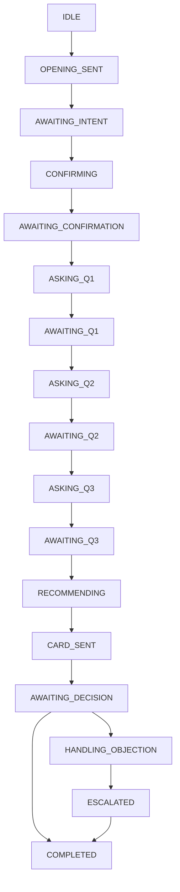

# Stella: WhatsApp Sales Agent for Strides

Stella is an automated WhatsApp sales agent that converts leads into purchases on the Strides website. She qualifies leads through adaptive conversational diagnosis, recommends the right product, and sends rich interactive cards — all via the official WhatsApp Cloud API.

## Architecture

Stella uses a **two-agent architecture** powered by a custom finite state machine (FSM):

```
WhatsApp Cloud API → FastAPI Webhook → Conversation Service → FSM
                                                                │
                                          ┌─────────────────────┤
                                          ▼                     ▼
                                    Agent 1: Concierge    Agent 2: Qualifier
                                    ┌───────────────┐     ┌──────────────────┐
                                    │ CRM Lookup    │     │ Structured Q's   │
                                    │ Origin Detect │     │ Classification   │
                                    │ Opening Msg   │     │ Recommendation   │
                                    │ Intent Extract│     │ Card + Closing   │
                                    └───────────────┘     └──────────────────┘
                                                                │
                                          ┌─────────────────────┤
                                          ▼                     ▼
                                    Recommender Engine     WhatsApp Card
                                    (anti-cannibalization)  Builder
```

**Agent 1 (Concierge)** identifies the lead in Kommo CRM, detects origin (LinkedIn/Site), sends a personalized opening, and extracts intent from the lead's open response.

**Agent 2 (Qualifier/Closer)** runs up to 3 structured questions, classifies the lead into clusters, recommends a product using deterministic anti-cannibalization rules, sends a rich WhatsApp card, and handles one objection.

## Products

| Product | Price Range | Format | Priority When |
|---------|------------|--------|---------------|
| Membership | R$12k–16k | 12 months, live | Senior + financial + live availability |
| Programa Executivo | R$3.5k–8.5k | 4 weeks, live | Specific challenge + live availability |
| Trilhas | Lower | On demand | Budget constraint or flexibility needed |
| Acervo On Demand | Lowest | On demand | Schedule limitation |

## Tech Stack

| Component | Technology |
|-----------|-----------|
| Framework | Python 3.12 + FastAPI |
| LLM | OpenAI GPT-4o + Anthropic Claude (configurable) |
| CRM | Kommo (read + write) |
| WhatsApp | Meta Cloud API (direct) |
| Database | MongoDB (via motor async) |
| LinkedIn Scraper | Relevance AI (existing internal API) |
| Audio | OpenAI Whisper API |
| Agent Orchestration | Custom FSM (no LangChain) |

## Setup

### Prerequisites

- Python 3.12+
- MongoDB running locally (or remote URI)
- WhatsApp Business Account with Cloud API access
- OpenAI API key (and/or Anthropic key)

### Installation

```bash
python3 -m venv .venv
source .venv/bin/activate
pip install -e ".[dev]"
```

### Configuration

```bash
cp .env.example .env
```

Fill in the required values in `.env`:

```env
# Required
WHATSAPP_TOKEN=your_whatsapp_access_token
WHATSAPP_PHONE_NUMBER_ID=your_phone_number_id
WHATSAPP_VERIFY_TOKEN=your_webhook_verify_token
OPENAI_API_KEY=your_openai_key
MONGODB_URI=mongodb://localhost:27017

# Optional
LLM_PROVIDER=openai                    # or "anthropic"
ANTHROPIC_API_KEY=your_anthropic_key   # if using anthropic
KOMMO_API_TOKEN=your_kommo_token
RELEVANCE_AI_API_URL=your_scraper_url
RELEVANCE_AI_AUTHORIZATION_TOKEN=your_scraper_token
```

### Running

```bash
uvicorn app.main:app --reload --port 8000
```

### Webhook Setup

1. Configure your Meta WhatsApp webhook URL to point to `https://your-domain/webhooks/whatsapp`
2. Use the `WHATSAPP_VERIFY_TOKEN` value when verifying the webhook in Meta's dashboard

## Conversation Flow

```
1. Lead sends first message
2. Stella looks up lead in Kommo CRM
3. Stella sends contextual opening (personalized if data exists)
4. Lead responds with open text (or audio)
5. Stella classifies intent into 4 clusters with confidence scores
6. If confident → confirm understanding; if ambiguous → ask clarification
7. Stella asks up to 3 structured questions (momentum, objection, LinkedIn)
8. Recommender engine picks product using anti-cannibalization rules
9. Stella sends personalized recommendation + WhatsApp interactive card
10. Lead decides → purchase on site, quick question, or objection
```

### Conversation States (FSM)



Special paths:
- **Price fallback**: Any state can detect a price request and handle it with a multi-level response strategy
- **Escalation**: Hands off to a human when needed (target: <20% of conversations)
- **Objection handling**: Handles one objection after card, may offer alternative product

## Anti-Cannibalization Rules

The recommender engine enforces these priority rules to protect premium positioning:

1. **Membership first** when: structured evolution + financial availability + live availability + senior profile
2. **Schedule → Trilhas**: schedule objection always routes to on-demand formats
3. **Corporate dependency → Programa**: suggest institutional material
4. **AI boost**: when AI interest detected + senior profile, prioritize AI products
5. **Never auto-downgrade**: volume/lower-tier products only when financial objection is explicitly stated

## Project Structure

```
app/
├── api/            # FastAPI routes (webhooks, health, admin)
├── models/         # Pydantic models (Conversation, Lead, Product)
├── fsm/            # State machine + 8 stage handlers
├── llm/            # LLM abstraction (OpenAI + Anthropic) + prompts
├── engine/         # Classifier, recommender, card builder
├── integrations/   # WhatsApp, Kommo, LinkedIn, Whisper clients
└── services/       # Orchestrator, lead enrichment, message formatting
```

## Testing

```bash
pytest tests/ -v
```

Tests cover:
- FSM state transitions and terminal states
- Recommender anti-cannibalization rules (8 scenarios)
- Cluster classifier confidence/ambiguity logic
- WhatsApp webhook payload parsing (text, audio, buttons)
- Card builder output for all products
- Message formatter (140-char splitting)

## API Endpoints

| Method | Path | Description |
|--------|------|-------------|
| `GET` | `/webhooks/whatsapp` | Meta webhook verification |
| `POST` | `/webhooks/whatsapp` | Receive WhatsApp messages |
| `GET` | `/health` | Health check (MongoDB ping) |
| `GET` | `/admin/conversations` | List recent conversations |
| `GET` | `/admin/conversations/{phone}` | View full conversation |

## WhatsApp Message Style

Stella follows WhatsApp Brazil conversational norms:
- Max 140 characters per message
- One idea per message
- Variable typing delay (600ms–2200ms)
- Contextual micro-validations before advancing
- Button-based quick replies for structured questions
- Anti-bot: varied phrasing, references lead's own words
