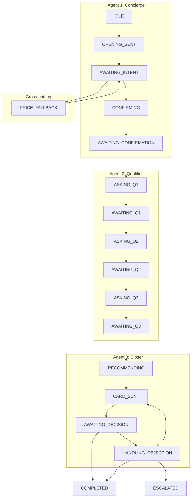

# Stella: WhatsApp Sales Agent for Strides

Stella is an automated WhatsApp sales agent that converts leads into purchases on the Strides website. She qualifies leads through adaptive conversational diagnosis, recommends the right product, and sends rich interactive cards — all via WhatsApp (Cloud API or Evolution API).

## Architecture

Stella uses a **three-agent architecture** powered by a custom finite state machine (FSM):

```
WhatsApp (Cloud API / Evolution API) -> FastAPI Webhook -> Conversation Service -> FSM
                                                                                    |
                      +-------------------------------------------------------------+----------------------------+
                      v                                                             v                            v
                Agent 1: Concierge                                       Agent 2: Qualifier               Agent 3: Closer
                +------------------+                                     +------------------+             +------------------+
                | CRM Lookup       |                                     | Structured Q1-Q3 |             | Recommendation   |
                | Origin Detection |      handoff                        | Cluster Profiling|   handoff   | Card Sending     |
                | Opening Message  | ----------------------------------> | Objection Mapping| ----------> | Decision Process |
                | Intent Classify  |                                     | LinkedIn Request |             | Objection Handle |
                | Confirmation     |                                     +------------------+             +------------------+
                +------------------+                                                                            |
                                                                                                       +---------+---------+
                                                                                                       v                   v
                                                                                                 Recommender          WhatsApp Card
                                                                                                 Engine               Builder
                                                                                                 (anti-cannibalization)
```

**Agent 1 (Concierge)** identifies the lead in Kommo CRM, detects origin (LinkedIn/Site), sends a personalized opening, extracts intent from the lead's open response, and confirms understanding before handoff.

**Agent 2 (Qualifier)** runs up to 3 structured questions to build the lead's profile: strategic moment (Q1), primary objection (Q2), and LinkedIn URL (Q3). Hands off to Closer once profiling is complete.

**Agent 3 (Closer)** runs the recommender engine, generates a personalized recommendation, sends the WhatsApp interactive card, processes the lead's decision (purchase, question, or objection), and handles one objection with an alternative product.

### Agent Boundaries

| Agent | Role | FSM States | Core Responsibility |
|-------|------|------------|---------------------|
| **Agent 1: Concierge** | Opener | IDLE -> OPENING_SENT -> AWAITING_INTENT -> CONFIRMING -> AWAITING_CONFIRMATION | CRM enrichment, greeting, intent classification, confirmation |
| **Agent 2: Qualifier** | Profiler | ASKING_Q1 -> AWAITING_Q1 -> ASKING_Q2 -> AWAITING_Q2 -> ASKING_Q3 -> AWAITING_Q3 | 3 structured questions, cluster/objection profiling |
| **Agent 3: Closer** | Converter | RECOMMENDING -> CARD_SENT -> AWAITING_DECISION -> HANDLING_OBJECTION | Product recommendation, card delivery, objection handling, conversion |
| **Cross-cutting** | Shared | PRICE_FALLBACK, ESCALATED | Multi-level price responses, human handoff |

### Handoff Flow

```
Concierge                    Qualifier                     Closer
    |                            |                            |
    |-- CRM lookup               |                            |
    |-- Send opening             |                            |
    |-- Classify intent          |                            |
    |-- Confirm understanding    |                            |
    |                            |                            |
    +-- ASKING_Q1 -------------->|                            |
                                 |-- Ask Q1 (moment)          |
                                 |-- Ask Q2 (objection)       |
                                 |-- Ask Q3 (LinkedIn)        |
                                 |                            |
                                 +-- RECOMMENDING ----------->|
                                                              |-- Run recommender engine
                                                              |-- Send recommendation + card
                                                              |-- Process decision
                                                              |-- Handle objection (if any)
                                                              |-- COMPLETED or ESCALATED
```

## Products

| Product | Price Range | Format | Priority When |
|---------|------------|--------|---------------|
| Membership | R$12k-16k | 12 months, live | Senior + financial + live availability |
| Programa Executivo | R$3.5k-8.5k | 4 weeks, live | Specific challenge + live availability |
| Trilhas | Lower | On demand | Budget constraint or flexibility needed |
| Acervo On Demand | Lowest | On demand | Schedule limitation |

## Tech Stack

| Component | Technology |
|-----------|-----------|
| Framework | Python 3.12 + FastAPI |
| LLM | OpenAI GPT-4o + Anthropic Claude (configurable) |
| CRM | Kommo (read + write) |
| WhatsApp | Meta Cloud API or Evolution API v2 (configurable) |
| Database | MongoDB (via motor async) |
| LinkedIn Scraper | Relevance AI (existing internal API) |
| Audio | OpenAI Whisper API |
| Agent Orchestration | Custom 3-agent FSM (no LangChain) |

## Setup

### Prerequisites

- Python 3.12+
- MongoDB running locally (or remote URI)
- WhatsApp Business Account (Cloud API access **or** Evolution API instance)
- OpenAI API key (and/or Anthropic key)

### Installation

```bash
python3 -m venv .venv
source .venv/bin/activate
pip install -e ".[dev]"
```

### Configuration

```bash
cp .env.example .env
```

Fill in the required values in `.env`:

```env
# Required
OPENAI_API_KEY=your_openai_key
MONGODB_URI=mongodb://localhost:27017

# WhatsApp provider: "cloud_api" (default) or "evolution"
WHATSAPP_PROVIDER=cloud_api

# Cloud API (when WHATSAPP_PROVIDER=cloud_api)
WHATSAPP_TOKEN=your_whatsapp_access_token
WHATSAPP_PHONE_NUMBER_ID=your_phone_number_id
WHATSAPP_VERIFY_TOKEN=your_webhook_verify_token

# Evolution API v2 (when WHATSAPP_PROVIDER=evolution)
EVOLUTION_API_URL=http://localhost:8080
EVOLUTION_API_KEY=your_evolution_api_key
EVOLUTION_INSTANCE_NAME=your_instance

# Optional
LLM_PROVIDER=openai                    # or "anthropic"
ANTHROPIC_API_KEY=your_anthropic_key   # if using anthropic
KOMMO_API_TOKEN=your_kommo_token
RELEVANCE_AI_API_URL=your_scraper_url
RELEVANCE_AI_AUTHORIZATION_TOKEN=your_scraper_token
```

### Running

```bash
uvicorn app.main:app --reload --port 8000
```

### Webhook Setup

**Cloud API**: Configure your Meta WhatsApp webhook URL to point to `https://your-domain/webhooks/whatsapp` and use the `WHATSAPP_VERIFY_TOKEN` value when verifying in Meta's dashboard.

**Evolution API**: Point your Evolution instance webhook to `https://your-domain/webhooks/whatsapp`. Authentication is handled via `apikey` header — no webhook verification step needed.

## Conversation Flow

```
1.  Lead sends first message
2.  [Concierge] Looks up lead in Kommo CRM
3.  [Concierge] Sends contextual opening (personalized if data exists)
4.  Lead responds with open text (or audio)
5.  [Concierge] Classifies intent into 4 clusters with confidence scores
6.  [Concierge] If confident -> confirm understanding; if ambiguous -> ask Q1
7.  [Qualifier] Asks up to 3 structured questions (moment, objection, LinkedIn)
8.  [Closer] Recommender engine picks product using anti-cannibalization rules
9.  [Closer] Sends personalized recommendation + WhatsApp interactive card
10. Lead decides -> purchase on site, quick question, or objection
11. [Closer] Handles objection with alternative product or escalates
```

### Conversation States (FSM)



Special paths:
- **Price fallback**: Detects price requests and responds with a multi-level strategy (3 escalating levels)
- **Escalation**: Hands off to a human when needed (target: <20% of conversations)
- **Objection handling**: Closer handles one objection after card, may offer alternative product
- **Ambiguous intent**: Concierge can skip confirmation and go directly to Q1 if intent is unclear

## Anti-Cannibalization Rules

The recommender engine enforces these priority rules to protect premium positioning:

1. **Membership first** when: structured evolution + financial availability + live availability + senior profile
2. **Schedule -> Trilhas**: schedule objection always routes to on-demand formats
3. **Corporate dependency -> Programa**: suggest institutional material
4. **AI boost**: when AI interest detected + senior profile, prioritize AI products
5. **Never auto-downgrade**: volume/lower-tier products only when financial objection is explicitly stated

## Production Guardrails

### LLM Output Safety

- **JSON retry**: `complete_json_safe` retries structured LLM calls up to 2 times on parse/validation failure, lowering temperature on each attempt
- **Classification fallback**: If intent classification fails entirely, returns uniform ambiguous scores — routes lead to Qualifier for clarification (safest path)
- **Output guard**: All outbound messages pass through `guard_output()` which enforces:
  - 140-character limit (truncates at sentence boundary)
  - 2-sentence maximum (single idea per message)
  - Context-aware fallback messages for empty LLM outputs

### Production Metrics

Metrics are written to a `metrics_events` MongoDB collection and queryable via admin endpoints:

- **Stage transitions**: per-stage drop-off with handler duration
- **Conversation outcomes**: completed, escalated, abandoned — with avg duration
- **Integration errors**: error rates grouped by integration (WhatsApp, Kommo, Whisper) and operation
- **Handler timing**: LLM + integration call latency per FSM stage

## Project Structure

```
app/
+-- api/              # FastAPI routes (webhooks, health, admin, metrics)
+-- models/           # Pydantic models (Conversation, Lead, Product)
+-- fsm/              # State machine + 9 stage handlers
|   +-- handlers/
|   |   +-- opening.py         # Agent 1: CRM lookup + opening
|   |   +-- intent.py          # Agent 1: Intent classification
|   |   +-- confirmation.py    # Agent 1: Smart confirmation
|   |   +-- qualifier.py       # Agent 2: Structured Q1-Q3
|   |   +-- recommendation.py  # Agent 3: Product recommendation
|   |   +-- closing.py         # Agent 3: Card delivery + decision
|   |   +-- objection.py       # Agent 3: Objection handling
|   |   +-- price_fallback.py  # Cross-cutting: Price responses
|   |   +-- escalation.py      # Cross-cutting: Human handoff
|   +-- machine.py     # FSM engine + action types
|   +-- states.py      # Transition matrix
+-- llm/              # LLM abstraction (OpenAI + Anthropic)
|   +-- base.py        # LLMProvider ABC + complete_json_safe retry
|   +-- prompts/
|   |   +-- concierge.py  # Agent 1 prompts
|   |   +-- qualifier.py  # Agent 2 prompts
|   |   +-- closer.py     # Agent 3 prompts
|   |   +-- classifier.py # Cluster classification prompt
+-- engine/           # Classifier, recommender, card builder
+-- integrations/     # WhatsApp, Kommo, LinkedIn, Whisper clients
|   +-- whatsapp/
|   |   +-- base.py          # WhatsAppProvider ABC
|   |   +-- client.py        # Factory (delegates to configured provider)
|   |   +-- cloud_api.py     # Meta Cloud API provider
|   |   +-- evolution_api.py # Evolution API v2 provider
|   |   +-- parser.py        # Cloud API webhook parser
|   |   +-- evolution_parser.py  # Evolution webhook parser
|   |   +-- models.py        # IncomingMessage, InteractiveCard, etc.
+-- services/         # Orchestrator, lead enrichment, message formatting
|   +-- conversation_service.py  # Main orchestrator
|   +-- metrics.py               # MetricsCollector (MongoDB-based)
|   +-- output_guard.py          # LLM output guardrails
|   +-- message_formatter.py     # 140-char message splitting
```

## Testing

```bash
pytest tests/ -v
```

95 tests covering:
- FSM state transitions and terminal states
- Recommender anti-cannibalization rules (12 scenarios including full cluster x objection matrix)
- Cluster classifier confidence/ambiguity logic + fallback on LLM failure
- WhatsApp webhook payload parsing (Cloud API + Evolution API)
- WhatsApp provider factory and interface compliance
- Card builder output for all products
- Message formatter (140-char splitting)
- Output guard (length enforcement, sentence limiting, fallback messages)
- LLM retry logic (validation error recovery, temperature decay)
- Handler unit tests (intent routing, objection handling)
- End-to-end conversation scenarios (ambiguous intent, price-only, objection after card, voice message, re-entry after silence)

## API Endpoints

| Method | Path | Description |
|--------|------|-------------|
| `GET` | `/webhooks/whatsapp` | Meta webhook verification (Cloud API only) |
| `POST` | `/webhooks/whatsapp` | Receive WhatsApp messages (Cloud API or Evolution) |
| `GET` | `/health` | Health check (MongoDB ping) |
| `GET` | `/admin/conversations` | List recent conversations |
| `GET` | `/admin/conversations/{phone}` | View full conversation |
| `GET` | `/admin/metrics/funnel?hours=24` | Stage drop-off funnel |
| `GET` | `/admin/metrics/outcomes?hours=24` | Conversion outcomes |
| `GET` | `/admin/metrics/errors?hours=24` | Integration error rates |

## WhatsApp Message Style

Stella follows WhatsApp Brazil conversational norms:
- Max 140 characters per message (enforced post-LLM via output guard)
- One idea per message
- Variable typing delay (600ms-2200ms)
- Contextual micro-validations before advancing
- Button-based quick replies for structured questions
- Anti-bot: varied phrasing, references lead's own words
